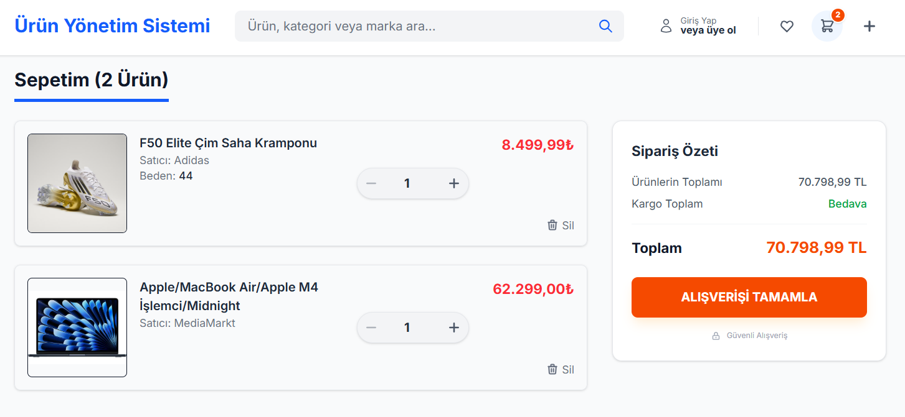
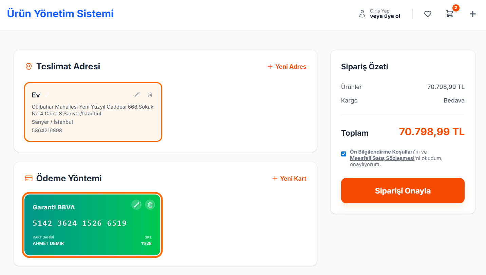
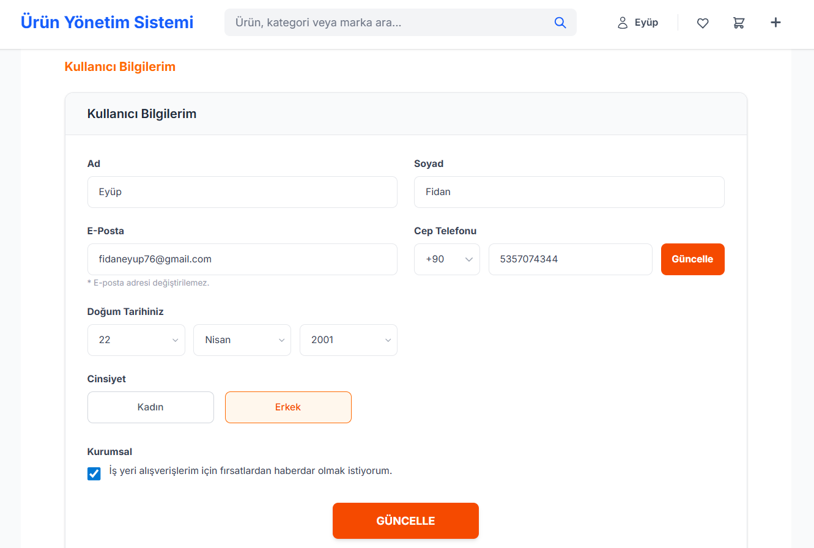

# Modern E-Commerce Application

A fully functional, premium e-commerce platform built with **Next.js 14**, **TypeScript**, and **Tailwind CSS**.

This project simulates a real-world shopping experience without a backend, utilizing **LocalStorage** for persistent data management (Cart, Users, Products). It features advanced form validations, a realistic checkout process, and a responsive design.


## Features

### Core Experience
* **Next.js App Router:** Modern routing and architecture.
* **Persistent Data:** All data (Cart, Auth, User Profile) is stored in the browser's LocalStorage.
* **Responsive Design:** Fully optimized for Desktop, Tablet, and Mobile.

### Authentication & User Profile
* **Custom Auth Modal:** Login and Register tabs with smooth transitions.
* **Simulated Social Login:** Realistic Google/Facebook login flows with loading states.
* **Smart Name Detection:** Extracts names from emails for a personalized experience.
* **User Dashboard:** Edit profile details (Name, Phone, Birthdate) with input masking.

### Shopping Cart
* **Real-time Updates:** Header cart badge updates instantly without page reload.
* **Smart Management:** Automatically handles item removal and quantity adjustments.
* **Persistence:** Cart items remain saved even after closing the browser.

### Premium Checkout
* **Realistic Credit Card Simulation:**
    * Visualizes cards with real bank colors (Ziraat, Garanti, etc.) and logos.
    * Interactive card selection.
* **Advanced Form Validation:**
    * Luhn-like algorithm logic for inputs.
    * Input masking for Phones (5XX...), Dates, and Credit Card numbers.
* **Address Management:** Add, Edit, and Delete delivery addresses.
* **Legal Modals:** Clean, drawer-style modals for "Terms of Service" and "Privacy Policy".

## Tech Stack

* **Framework:** [Next.js 14](https://nextjs.org/) (App Router)
* **Language:** [TypeScript](https://www.typescriptlang.org/)
* **Styling:** [Tailwind CSS](https://tailwindcss.com/)
* **Icons:** Inline SVG Icons (No external heavy libraries)
* **State Management:** React Hooks (useState, useEffect, useContext) & LocalStorage Events.

## Screenshots

| Shopping Cart | Payment Page |
|---------------|--------------|
|  |  |

| User Information |
|------------------| 
|  |

## Getting Started

Follow these steps to run the project locally:

1.  **Clone the repository:**
    ```bash
    git clone [https://github.com/eyup-fidan/E-Commerce-Application.git](https://github.com/eyup-fidan/E-Commerce-Application.git)
    ```

2.  **Navigate to the project directory:**
    ```bash
    cd E-Commerce-Application
    ```

3.  **Install dependencies:**
    ```bash
    npm install
    # or
    yarn install
    ```

4.  **Run the development server:**
    ```bash
    npm run dev
    ```

5.  Open [http://localhost:3000](http://localhost:3000) with your browser to see the result.

## Contributing

Contributions, issues, and feature requests are welcome!

1.  Fork the Project
2.  Create your Feature Branch (`git checkout -b feature/AmazingFeature`)
3.  Commit your Changes (`git commit -m 'Add some AmazingFeature'`)
4.  Push to the Branch (`git push origin feature/AmazingFeature`)
5.  Open a Pull Request

---

<p align="center">
  Built by Eyüp Fidan
</p>
